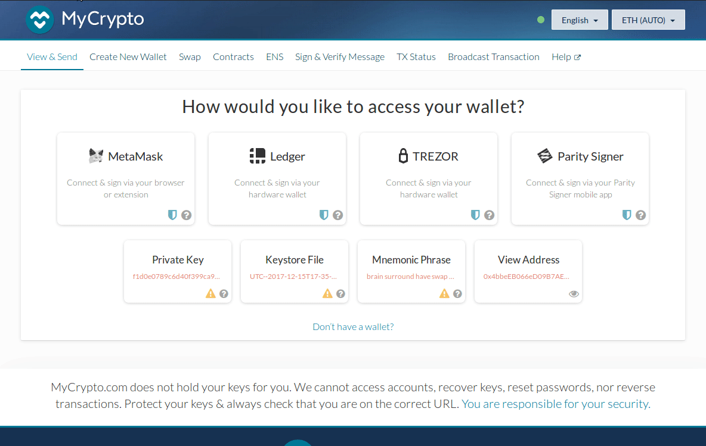
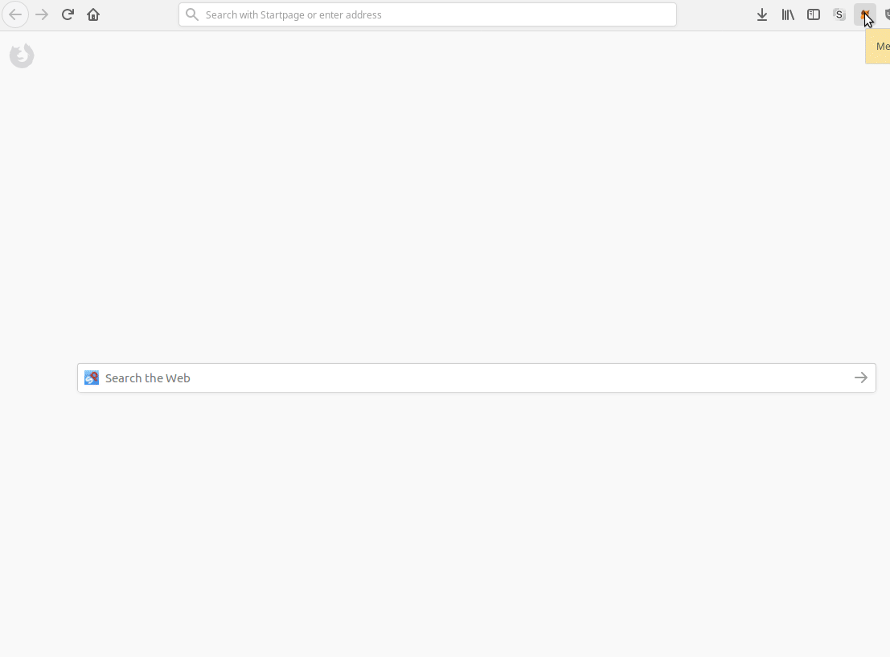

The service [wallet.parity.io](https://wallet.parity.io/) has been deprecated and can not be used anymore. Instead, a page was created to allow you to download the keystore file (JSON/UTC) for users to be able to access their account with parity client or 3rd party applications. Note that to be able to access your account, you will need to open it using a password set at the account creation. Without this password, no application can access your account.

## View and use your account on MyCrypto

- Visit [MyCrypto](https://mycrypto.com/account) and click on `Keystore File` button.
- Make sure to read and accept the warning then click on `continue`.
- Click on `select wallet file` and select the desired file.
- Enter the password corresponding to this account and click `unlock`.
- You can now see the balance of your account and send Ether from it.

## View and use your account on Metamask beta

Metamsk beta allows using an account from a JSON/UTC file. Here is how to proceed:
- If you haven't done so already download [Metamask](https://metamask.io/) on your favourite browser.
- If you haven't any yet, create a dummy account to be able to use the beta version of Metamask.
- In the hamburger menu from the top right corner, select `Try beta!`.
- Using Metamask in full-screen mode is more convenient, click on the arrow icon at the top right to switch to full screen.
- Slick on the account image at the top right and select `Import account`.
- Select type `JSON file`.
- Select the previously downloaded JSON/UTC file and click `Import`.

## View and use your account on MyCrypto Desktop application

- Visit [MyCrypto download page](https://download.mycrypto.com/) and download the application for your platform.
- Make sure to read and understand the warning.
- Click on `Keystore File` button.
- Click on `Select wallet file` and select the desired file.
- Enter the password corresponding to this account and click `unlock`.
- You can now see the balance of your account and send Ether from it.

